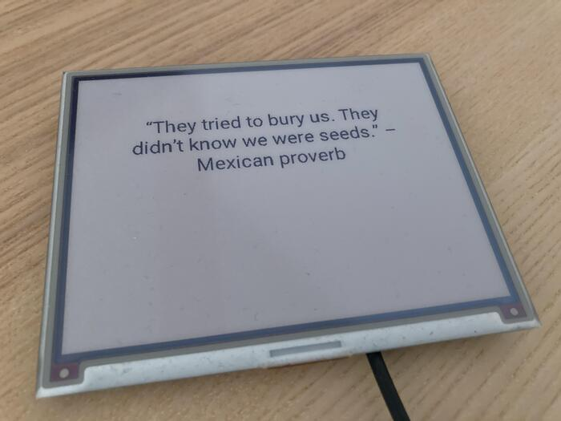

weather

curl -X GET "https://api.pirateweather.net/forecast/jAxRKANBF45bAfs1TM3SO2tTldyWo36L8Ns1CN0H/21.306944,-157.858333" -H  "accept: application/json" -H  "x-api-key: jAxRKANBF45bAfs1TM3SO2tTldyWo36L8Ns1CN0H"

Sparkline modules

Dash.Sparkline.ScenicComponent
- Receives a %Contex.Sparkline{} and renders it to Scenic primitives

Dash.Sparkline
- Receives a %Contex.Sparkline{} and returns a %Dash.Sparkline{}

Dash.SvgPathParser
- Receives an SVG path (the `d` parameter) and parses it into draw commands

TODO:
- [ ] refresh daily
- [ ] display all the graphs
- [ ] label the graphs
- [ ] don't put the data fetch in the scenic component

[Scenic](https://github.com/boydm/scenic/) application to drive an Inky Impression

Currently is able to display a random quote from a Trello list that I have.

UI is currently very basic and looks like:

And this is what it looks like on the actual device:

## Attributions

CSS Color Names from:
https://github.com/bahamas10/css-color-names/blob/master/css-color-names.json

Weather icons from: https://www.flaticon.com/free-icons/weather
