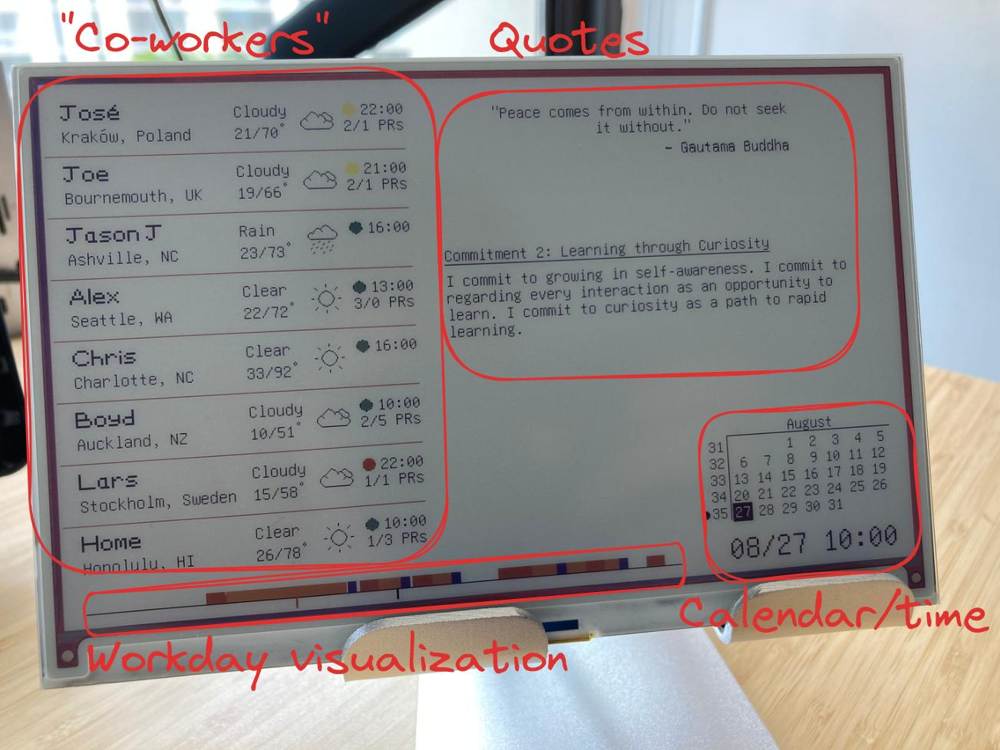

Dash is a [Scenic](https://github.com/ScenicFramework/scenic) application to
drive an Inky Impression

This is what it looks like on the actual device (note: this is all
sample/example data):

Here's the seperate sections of the display:

I talked about how I use this in my home office setup at ElixirConf 2023. Here
are the slides: https://jasonaxelson.com/talks/inky

## Installing

`ssh nerves.local` and then run:
- `Dash.Release.migrate()`

## Attributions

CSS Color Names from:
https://github.com/bahamas10/css-color-names/blob/master/css-color-names.json

Weather icons from: https://www.flaticon.com/free-icons/weather
