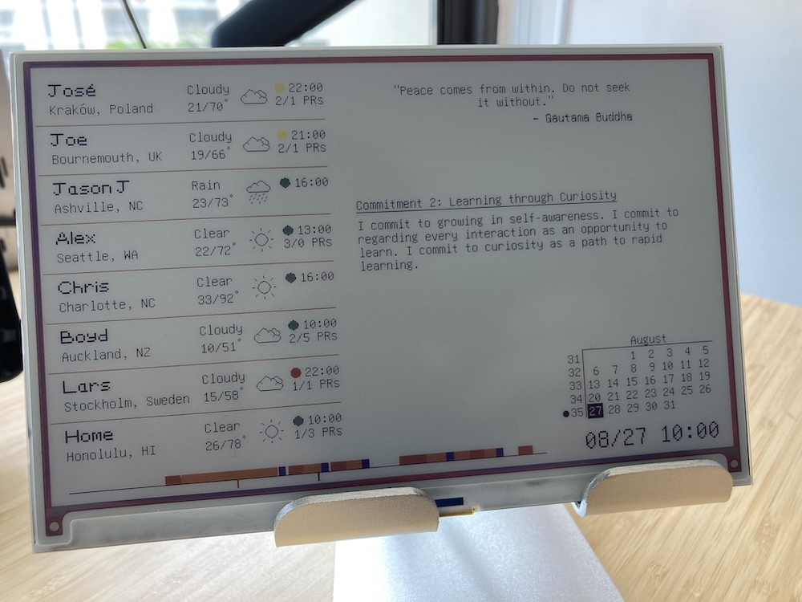

[Scenic](https://github.com/boydm/scenic/) application to drive an Inky Impression

Currently is able to display a random quote from a Trello list that I have.

UI is currently very basic and looks like:

And this is what it looks like on the actual device:

